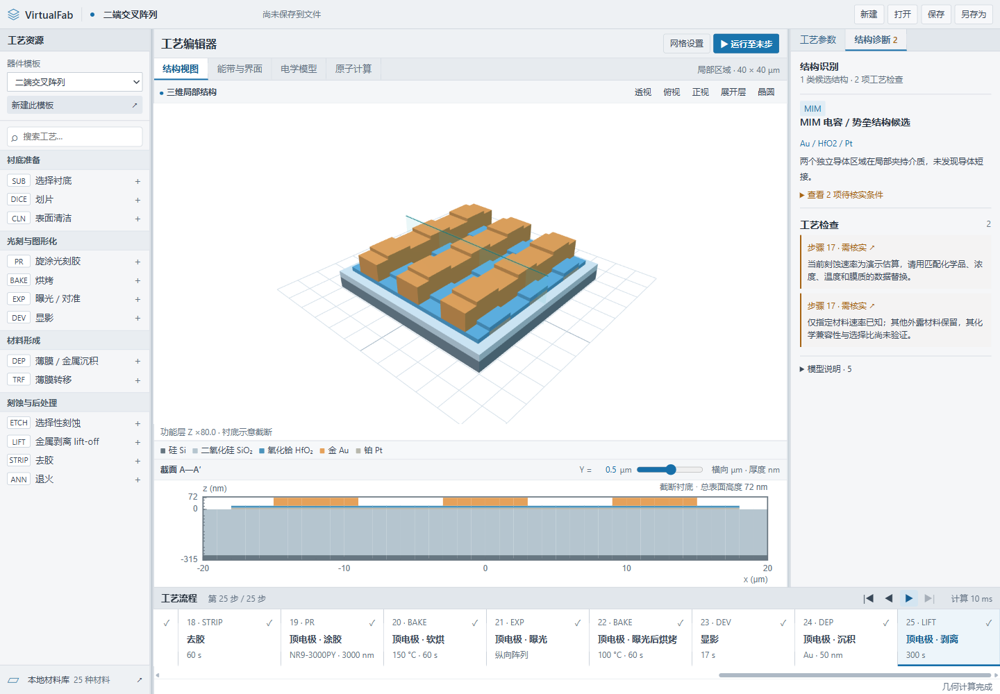
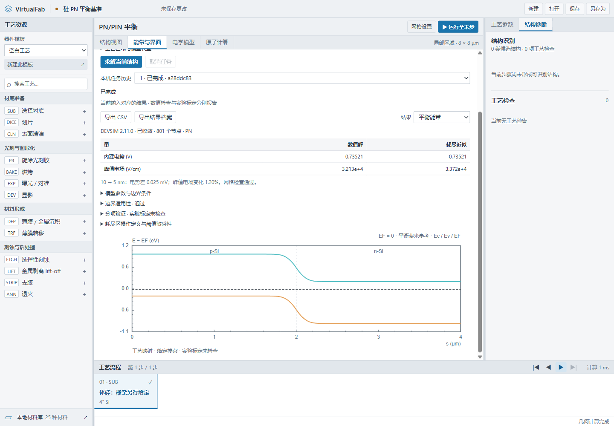
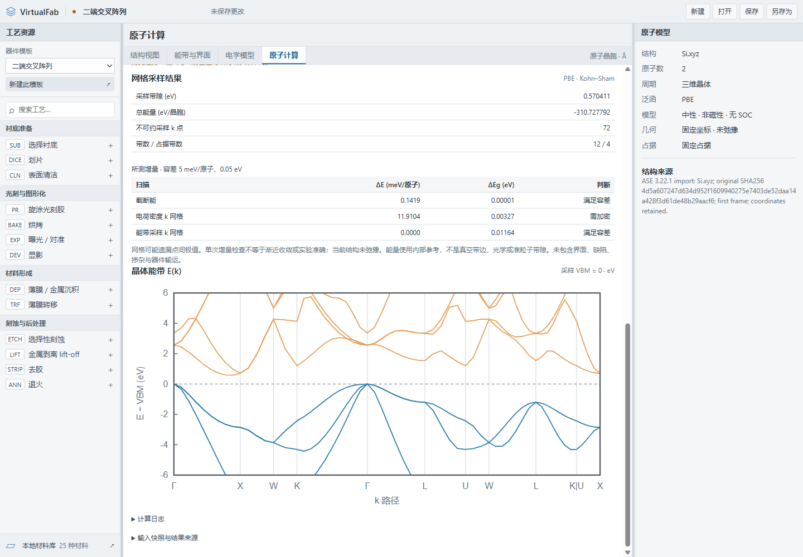

<div align="center">

# VirtualFab Studio

**面向薄膜工艺与半导体器件结构的本地工作台。**

编排工艺、检查三维结构、追溯材料参数，并计算适用硅结构的平衡状态。

[](https://github.com/Ausanx/VirtualFab/actions/workflows/checks.yml)
[](LICENSE)
[](#快速开始)
[](#模型范围)

[English](README.md) · **简体中文**

[快速开始](#快速开始) · [功能](#功能) · [验证](#验证) · [路线图](#路线图)

</div>



从一份工艺配方查看它产生的结构：涂胶、曝光、显影、沉积、刻蚀和剥离分别保留为可编辑的步骤。检查实际膜层和接触关系，记录材料参数的来源与条件，再将符合要求的硅区域映射为一维 PN/PIN 平衡模型。

桌面版使用 Electron，本地 JSON 保存项目，本地后端完成计算。独立的原子工作区可运行 Si 和单层 MoS₂ 的 Quantum ESPRESSO 计算。**当前版本为工程原型**，各项能力的数值检查和适用范围均有记录。

## 功能

| 工作流程 | 当前可用能力 |
| --- | --- |
| 工艺编排 | 二端交叉阵列、全局底栅、局部顶栅、异质结和空白模板；新增、修改、重排、禁用和逐步回放工艺。 |
| 结构检查 | 三维局部结构、展开层、晶圆/划片示意、可移动剖面，以及横向采样网格比较。 |
| 材料与界面 | 25 个初始材料条目；自定义参数、来源与条件；接触拓扑、PN/PIN 候选、栅控结构和有证据支持的能带阶。 |
| 硅平衡计算 | 由连续矩形硅域和给定掺杂生成一维 PN/PIN 模型，显示电势、能带、载流子、电场及耗尽区阈值敏感性。 |
| 原子计算 | CIF、POSCAR、扩展 XYZ 导入；本地 QE SCF、均匀网格 NSCF、高对称路径能带及参数敏感度检查。 |
| 项目与结果 | 新建/打开/保存 JSON、后台取消、历史输入查看、CSV 与配套元数据、完整结果 JSON 导出。 |

| 工艺映射的硅 PN 平衡 | 原子工作区 |
| --- | --- |
|  |  |

*截图使用软件内置示例；当前应用界面为中文。*

## 快速开始

### 启动工艺编辑器

安装 [Node.js 22.12 或更新版本](https://nodejs.org/) 和 Git：

```sh
git clone https://github.com/Ausanx/VirtualFab.git
cd VirtualFab
npm ci
npm start
```

打开 **[127.0.0.1:4173](http://127.0.0.1:4173)**，即可编排工艺和查看结构。计算后端通过桌面版使用。

Windows 桌面入口：

```sh
npm run desktop
```

选择模板、逐步回放工艺、检查剖面，再保存 JSON 项目。首次安装需要下载依赖，日常编辑可离线进行。

### 启用 Windows 本地硅求解器

安装 [uv](https://docs.astral.sh/uv/getting-started/installation/) 后执行：

```powershell
uv venv --python 3.13 .venv-solver
uv pip install --python .venv-solver\Scripts\python.exe -r solver/requirements.txt
npm run build:solver
npm run desktop
```

进入 **能带与界面 → PN/PIN 平衡 → 当前工艺结构**，新建硅 PN 或 PIN 基准，检查区域与路径后求解。后端使用 DEVSIM 2.11.0，并打包 Python 与 OpenBLAS。

### 可选：启用原子计算

先安装 WSL2 与 Git for Windows：

```powershell
npm run setup:dft
```

安装器建立独立的 `VirtualFab-QE` WSL2 环境，下载并校验输入文件、本地编译 QE 7.5。首次安装需要网络、磁盘空间和编译时间，后续计算在本机完成。详情见[安装指南](docs/guide.zh-CN.md#本地-dft-后端)和 [DFT 方法](docs/validation/dft-method.md)。

### 构建 Windows 便携版

完成上述求解器构建依赖安装后：

```powershell
npm run package:win
```

打开 `dist/VirtualFab-win32-x64/VirtualFab.exe`，整个目录需放在一起。便携版包含硅求解器，QE 与 Linux 环境另行安装。[完整使用与构建指南](docs/guide.zh-CN.md)保留文件操作、后端配置和全部检查命令。

## 模型范围

| 模块 | 当前范围与限制 |
| --- | --- |
| 工艺几何 | XY 采样列与连续 Z 区间；沉积采用顶表面近似。未求解完整三维工艺动力学、侧壁通量或实验工艺标定。 |
| 材料数据 | 来源与条件单独记录；许多初始值仍为估算，InON 带隙与亲和能保持缺失。未知不会当作零。 |
| 器件物理 | 300 K、零偏压、体硅同质 PN/PIN；无补偿的给定掺杂、完全电离、Boltzmann 统计、理想中性欧姆端部。几何映射要求均匀的矩形横截面。 |
| DFT | 固定几何 PBE、非磁性、中性、标量相对论，首版验证 Si/MoS₂。输出采样 Kohn–Sham 能带与带隙，与工艺几何和器件输运分别处理。 |
| 验证状态 | 数值收敛、边界适用性、文献比较和实验标定分别报告。求解器成功退出不代表器件精度已获验证。 |

Shockley I–V 示例使用手动给定的模型参数；可预测输运、栅控特性、记忆效应和光生动力学尚未接入。

**项目 JSON 保存任务引用，不包含实际计算文件。** 原始数据位于本机的 `physics-jobs/<UUID>` 与 `dft-jobs/<UUID>`。单独复制 JSON 不会迁移这些证据。输入变化后旧结果标为历史；未收敛或损坏结果不显示为有效曲线。

## 验证

核心检查：

```sh
npm test
npm run check
```

GitHub Actions 在 Windows 与 Linux 执行上述检查。桌面交互和真实物理计算另有本地检查：

```powershell
npm run test:browser
npm run test:desktop
npm run validate:physics
npm run validate:device
npm run test:device:desktop
```

物理检查需要先构建求解器，DFT 检查需要已安装的 QE 后端。方法、结果和完整命令：

- [发布审查与验证记录](docs/validation/release-review.md)
- [硅平衡基准](docs/validation/equilibrium-results.md) · [工艺到器件映射](docs/validation/device-equilibrium.md)
- [文献比较方法](docs/validation/literature-calibration.md) · [比较结果](docs/validation/literature-results.md)
- [DFT 方法](docs/validation/dft-method.md) · [真实 QE 结果](docs/validation/dft-results.md)

`npm run validate:literature:strict` 目前会因默认 MoS₂/WSe₂ 参数未通过实测带阶比较而失败，这是保留的标定缺口。Si 电荷密度网格和 MoS₂ 截断能仍需进一步加密，详见 DFT 报告。

## 路线图

- [x] 工艺编辑、几何检查与材料证据记录。
- [x] 区域级掺杂与工艺到硅平衡映射（A–B）。
- [x] 本地原子计算及输入/结果溯源。
- [ ] 独立数值比较与完整公开基准（C）。
- [ ] 可迁移的计算证据包（D）。
- [ ] 经验证的硅暗态 J–V（E）。
- [ ] 条件匹配的 MoS₂/WSe₂ 扩展（F）。

各阶段验收条件见[已确认物理路线](docs/plans/2026-10-07-physics-closure-design.md)。

## 参与贡献

提交 [Issue](https://github.com/Ausanx/VirtualFab/issues) 时请说明复现步骤、应用/运行时版本和预期结果；便于分享时可附一个最小示例项目。修改保持聚焦并运行相关检查。新增物理模型时，请一并说明单位、假设、参数来源和可复现基准。

## 许可与致谢

VirtualFab 自有源码采用 [MIT](LICENSE) 许可。项目使用 [Electron](https://github.com/electron/electron)、[Three.js](https://github.com/mrdoob/three.js)、[Split Grid](https://github.com/nathancahill/split)、[DEVSIM](https://github.com/devsim/devsim)，并提供 [Quantum ESPRESSO](https://www.quantum-espresso.org/) 适配器。第三方组件保留各自许可，详见[求解器说明](solver/THIRD-PARTY.md)和 [DFT 说明](dft/THIRD-PARTY.md)。
